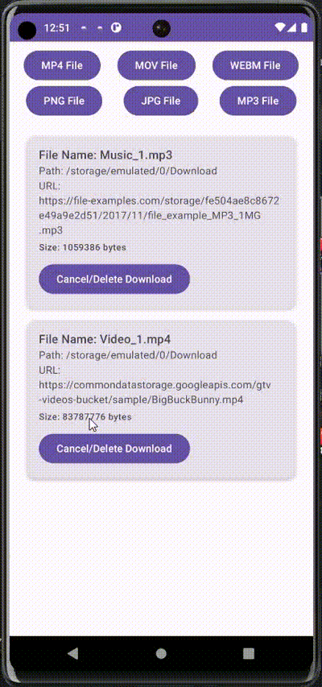

# Leech-Android

[](https://jitpack.io/#fakhrirasyids/leech)

Leech is a lightweight, open-source Kotlin-based library designed to streamline background file downloads in Android applications. Built with CoroutineWorker, Kotlin Flow, Room, and Retrofit, Leech efficiently handles multiple download tasks while providing seamless updates and notification management for each download. 

## How to add

### Step 1
	dependencyResolutionManagement {
		repositoriesMode.set(RepositoriesMode.FAIL_ON_PROJECT_REPOS)
		repositories {
			mavenCentral()
			maven { url 'https://jitpack.io' } // Add this
		}
	}

### Step 2
	dependencies {
	        implementation 'com.github.fakhrirasyids:leech:0.0.1'
	}

## Preview
|  | 
| :---:                              | 
|   |

## Permissions

Here are the necessary permissions to add to your app.
- **INTERNET**
- **POST_NOTIFICATIONS**
- **STORAGE** Permissions
- **FOREGROUND_SERVICE_DATA_SYNC**
- **WAKE_LOCK**

## Usage

Leech is a singleton class that provides an interface for managing download requests. To use it easily, simply initialize it in the onCreate method of your application class.

### Simple Initial Setup

To get an instance of Leech in your application, pass the "notificationIcon" parameter with an icon or drawable from your resource folder. The "notificationImportance" parameter is set to IMPORTANCE_DEFAULT, but you can modify it according to your preferences.

``` kotlin
    private lateinit var leech: Leech

    override fun onCreate() {
      super.onCreate()
      leech = Leech.getInstance(
        context = this,
        notificationIcon = // Fill with your icon/drawable from your resource folder,
        notificationImportance = NotificationManager.IMPORTANCE_DEFAULT // Fill notification importance from NotificationManager importance value
      )
    }
```

### Leech's Methods

Here are several methods of Leech that can be used.

#### Download

Initiates a download request.

``` kotlin
leech.download(
  url = // The URL of the file to download,
  path = // The file path where the downloaded file will be saved,
  fileName = // Optional name for the file, defaults to a name constructed from the URL,
  headers = // Optional headers for the download request, defaults to an empty map
)
```

#### Observe All Downloads

Observes all download items and returns a Flow of a mutable list of LeechDownloadEntity objects.

``` kotlin
leech.observeAllDownloadItems() // returning Flow<MutableList<LeechDownloadEntity>>
```

#### Observe Download Item

Observes a specific download item by its unique ID and returns a Flow of the corresponding LeechDownloadEntity objects.

``` kotlin
leech.observeDownloadItem(leechId = // downloadId) // returning Flow<LeechDownloadEntity?>
```

#### Cancel All Downloads

Cancels all active download items.

``` kotlin
leech.cancelAllDownloadItems() 
```


#### Cancel Download Item

Cancels a specific download item by its unique ID.

``` kotlin
leech.cancelDownloadItem(leechId = // downloadId) 
```

## Contribute to the Project

Leech is an open-source project, and contributions are always welcome! Whether you want to report an issue, request a new feature, or submit a pull request, your contributions help make the library even better. 😋🙌

Feel free to create an issue or open a pull request on GitHub.

## License

```
   Copyright 2024 Fakhri Rasyid Saputro
   Licensed under the Apache License, Version 2.0 (the "License");
   you may not use this file except in compliance with the License.
   You may obtain a copy of the License at

       http://www.apache.org/licenses/LICENSE-2.0

   Unless required by applicable law or agreed to in writing, software
   distributed under the License is distributed on an "AS IS" BASIS,
   WITHOUT WARRANTIES OR CONDITIONS OF ANY KIND, either express or implied.
   See the License for the specific language governing permissions and
   limitations under the License.
```
